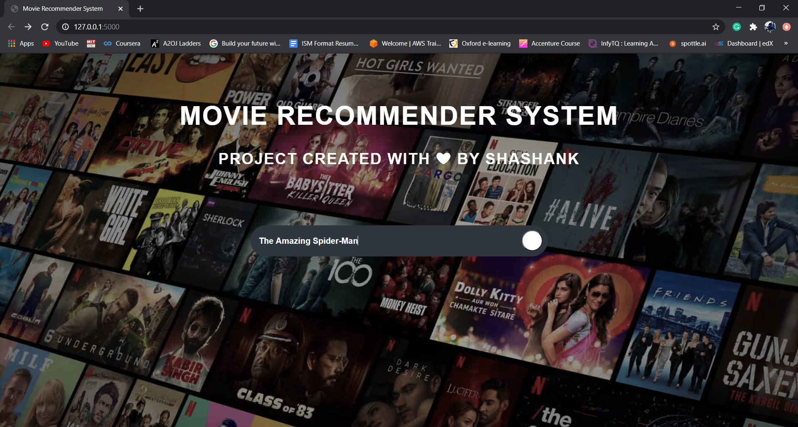
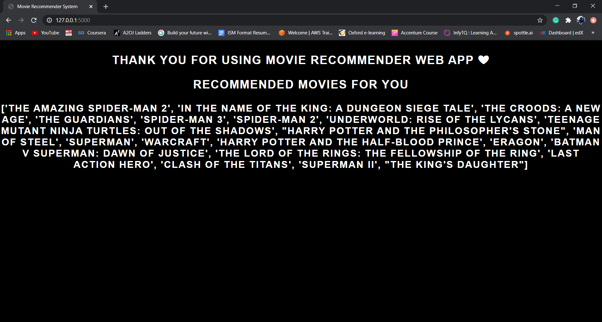

# Movie Recommender System Using Python

> [Description](#description)

> [Data Sources](#data-source)

> [Built With](#built-with)

> [Preview](#preview)

> [Project File Description](#project-file-description)

> [How to run this project](#how-to-run-this-project)

---

# Description

Recommendation Systems are everywhere from <strong>Youtube</strong> recommending similar videos, from <strong>Netflix</strong> recommending similar movies to <strong>Spotify</strong> recommending songs according to our interests. In short a recommendation system is an algorithm focussed at suggesting relevant recommendations to a user based on past preferences of the user or suggesting relevant data to the user based on the item’s features. There are two paradigms of recommender systems: Collaborative and Content Based methods. I created this recommendation system using Content based method. I used the details of the movie like cast and crew, genres, overview of the movie to predict the recommendations for the user.

---

# Data Sources

1. [The Movies Dataset](https://www.kaggle.com/rounakbanik/the-movies-dataset)
2. [TMDB 5000 Movies Data set](https://www.kaggle.com/tmdb/tmdb-movie-metadata)
3. [American films of 2018](https://en.wikipedia.org/wiki/List_of_American_films_of_2018)
4. [American films of 2019](https://en.wikipedia.org/wiki/List_of_American_films_of_2019)
5. [American films of 2020](https://en.wikipedia.org/wiki/List_of_American_films_of_2020)

---

# Built With

---

# Preview

Preview of the webpage is shown below

---

---

# Project File Description

- 'styles/css' folder has the css and images files for the view of the web page.
- 'templates' folder has the html files for the view of the web page.
- 'main_data.csv' is the main dataset used for building the recommendation system.
- 'data_preprocessing.ipynb' files consist of data cleaning and data modification process performing on the various datasets.
- 'movie_recommendation.py' file consists of all the functions required for building the recommendation system.
- 'movie-recommendation-demo.mp4' is a video file consists of a demo of the working prototype of the project.

---

# How to run this project

1) Download zip or clone it using 'git clone https://github.com/shashank1711/Movie-Recommender-System.git'
2) Unzip the downloaded file.
3) Run command 'pip install -r requirements.txt' to install the dependencies.
4) Run the project by using 'python app.py' from the directory you have stored the file.
